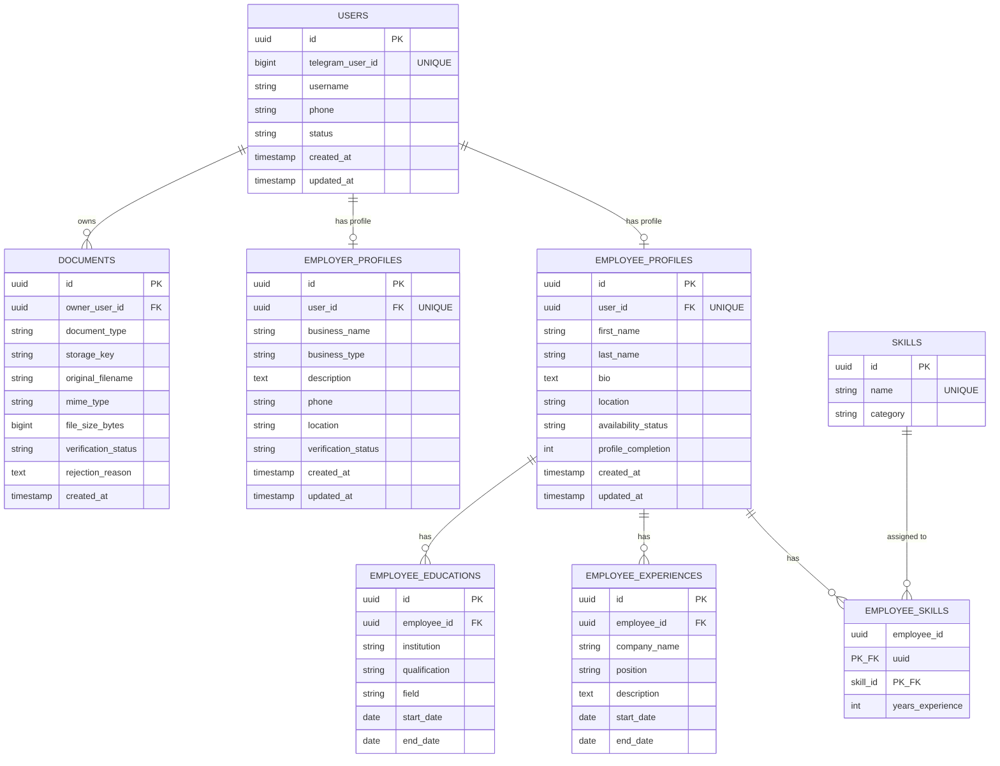

# Project Documentation

**Project:** Telegram Reverse Employment Marketplace (Ethiopia)  
**Version:** 1.0  
**Status:** Architecture & Design Phase  

---

## 📋 Navigation Menu (Table of Contents)

- [1. Technical Stack](#1-technical-stack)
- [2. Entity-Relationship (ER) Diagram](#2-entity-relationship-er-diagram)
- [3. Entity Descriptions & Relationships Summary](#3-entity-descriptions--relationships-summary)
  - [3.1 Identity & Core Entities](#31-identity--core-entities)
  - [3.2 Employee Domain](#32-employee-domain)
  - [3.3 Employer Domain](#33-employer-domain)
- [4. Telegram Authentication Mechanism](#4-telegram-authentication-mechanism)
  - [4.1 Validation Algorithm](#41-validation-algorithm-fastapi-backend)
- [5. Registration & Core API Specifications](#5-registration--core-api-specifications)
  - [5.1 Authentication API](#51-authentication-api)
  - [5.2 User Identity API](#52-user-identity-api)
  - [5.3 Employee Profile & Registration APIs](#53-employee-profile--registration-apis)
  - [5.4 Employer Profile & Verification APIs](#54-employer-profile--verification-apis)
  - [5.5 Document Upload APIs](#55-document-upload-apis)
- [6. Registration Status Tracking & State Machine](#6-registration-status-tracking--state-machine)
  - [6.1 Registration State Flow](#61-registration-state-flow)
  - [6.2 Registration Status API](#62-registration-status-api)
- [7. Basic Security & Authorization Model](#7-basic-security--authorization-model)
  - [7.1 Role-Based Access Control (RBAC)](#71-role-based-access-control-rbac)
  - [7.2 Resource Ownership Authorization](#72-resource-ownership-authorization)
  - [7.3 Input Validation & Data Sanitization](#73-input-validation--data-sanitization)
  - [7.4 CORS & Rate Limiting Policy](#74-cors--rate-limiting-policy)

---

## 1. Technical Stack

The core tech stack for the platform backend and database is specified below:

| Layer | Technology Choice | Details / Notes |
|---|---|---|
| **Backend Language** | **Python** | Version 3.11+ |
| **Backend Framework** | **FastAPI** | Async REST APIs, Pydantic validation, Auto OpenAPI docs |
| **Database** | **PostgreSQL** | Primary relational store, source of truth |
| **ORM / Migration** | **SQLAlchemy 2.0 (Async) + Alembic** | Database models & migration tracking |
| **Storage Infrastructure** | **TBD (Pending Decision)** | Evaluating AWS S3, Cloudflare R2, Google Cloud Storage, or MinIO |
| **Client Interface** | **Telegram Mini App + Telegram Bot** | Telegram Mini App for primary web experience, Bot for notifications |

---

## 2. Entity-Relationship (ER) Diagram

The ER diagram below represents all Sprint 1 entities, their attributes, keys, and relational cardinalities.



---

## 3. Entity Descriptions & Relationships Summary

### 3.1 Identity & Core Entities
- **USERS:** Holds Telegram authentication mapping (`telegram_user_id`), phone number, and global user status. Maps 1-to-1 optionally with `EMPLOYEE_PROFILES` or `EMPLOYER_PROFILES`.
- **DOCUMENTS:** Owned by a `USER` (`owner_user_id`). Stores metadata for uploaded files (CVs, Trade Licenses, TIN Certificates) and storage keys.

### 3.2 Employee Domain
- **EMPLOYEE_PROFILES:** Stores candidate personal info, location, bio, and profile completion metric.
- **SKILLS & EMPLOYEE_SKILLS:** Many-to-many relationship linking employees to skills with years of experience.
- **EMPLOYEE_EXPERIENCES:** 1-to-many relationship storing candidate past work history.
- **EMPLOYEE_EDUCATIONS:** 1-to-many relationship storing candidate educational background.

### 3.3 Employer Domain
- **EMPLOYER_PROFILES:** Stores business details, company type, contact phone, and business verification status (`PENDING`, `UNDER_REVIEW`, `VERIFIED`, `REJECTED`).

---

## 4. Telegram Authentication Mechanism

Telegram Mini Apps pass user identity and cryptographic signatures via `window.Telegram.WebApp.initData`.

```text
┌────────────────────────┐                   ┌────────────────────────┐
│ Telegram Mini App (UI) │                   │  FastAPI Backend API   │
└───────────┬────────────┘                   └───────────┬────────────┘
            │                                            │
            │ 1. Sends initData in Authorization Header  │
            │    Authorization: Bearer <initData>       │
            ├───────────────────────────────────────────►│
            │                                            │
            │                                            │ 2. Calculates HMAC-SHA256
            │                                            │    with BOT_TOKEN
            │                                            │ 3. Verifies hash signature
            │                                            │ 4. Upserts user in PostgreSQL
            │                                            │ 5. Generates JWT Session Token
            │                                            │
            │ 6. Returns JWT & User Profile Summary      │
            │◄───────────────────────────────────────────┤
            │                                            │
```

### 4.1 Validation Algorithm (FastAPI backend)
1. Extract `initData` query string parameter.
2. Parse key-value pairs and separate `hash`.
3. Sort remaining parameters lexicographically by key and join with `\n` to form `data_check_string`.
4. Derive secret key using HMAC-SHA256: `secret_key = HMAC_SHA256("WebAppData", BOT_TOKEN)`.
5. Calculate hash: `calculated_hash = HMAC_SHA256(data_check_string, secret_key)`.
6. Validate `calculated_hash == hash` using constant-time string comparison.
7. Verify `auth_date` is not older than 86,400 seconds (24 hours).
8. Parse user JSON object from `user` parameter to extract `telegram_user_id`, `username`, etc.

---

## 5. Registration & Core API Specifications

Base URL: `/api/v1`

### 5.1 Authentication API

#### `POST /api/v1/auth/telegram`
Authenticates Telegram Mini App user.

* **Headers:** `Content-Type: application/json`
* **Request Body:**
  ```json
  {
    "init_data": "query_id=...&user=...&auth_date=...&hash=..."
  }
  ```
* **Response (200 OK):**
  ```json
  {
    "access_token": "eyJhbGciOiJIUzI1NiIsInR5cCI...",
    "token_type": "bearer",
    "user": {
      "id": "a3b8c9d1-0000-4000-8000-123456789abc",
      "telegram_user_id": 987654321,
      "username": "johndoe",
      "roles": ["EMPLOYEE"]
    }
  }
  ```

---

### 5.2 User Identity API

#### `GET /api/v1/users/me`
Fetches authenticated user information.

* **Headers:** `Authorization: Bearer <access_token>`
* **Response (200 OK):**
  ```json
  {
    "id": "a3b8c9d1-0000-4000-8000-123456789abc",
    "telegram_user_id": 987654321,
    "username": "johndoe",
    "phone": "+251911223344",
    "has_employee_profile": true,
    "has_employer_profile": false,
    "created_at": "2026-09-17T12:00:00Z"
  }
  ```

---

### 5.3 Employee Profile & Registration APIs

#### `POST /api/v1/employees/profile`
Creates or updates employee profile and skills.

* **Headers:** `Authorization: Bearer <access_token>`
* **Request Body:**
  ```json
  {
    "first_name": "Abebe",
    "last_name": "Bikila",
    "bio": "Experienced software developer specializing in Python and web apps.",
    "location": "Addis Ababa",
    "skills": [
      { "name": "Python", "category": "Software Engineering", "years_experience": 4 },
      { "name": "FastAPI", "category": "Backend", "years_experience": 3 }
    ],
    "experiences": [
      {
        "company_name": "Tech Corp Ethiopia",
        "position": "Backend Developer",
        "description": "Built scalable APIs",
        "start_date": "2023-01-01",
        "end_date": "2025-12-31"
      }
    ],
    "educations": [
      {
        "institution": "Addis Ababa University",
        "qualification": "BSc",
        "field": "Computer Science",
        "start_date": "2019-09-01",
        "end_date": "2023-07-01"
      }
    ]
  }
  ```
* **Response (200 OK):** Returns full created/updated `EmployeeProfile` model.

#### `GET /api/v1/employees/me`
Retrieves current employee profile details, attached skills, and uploaded CV metadata.

---

### 5.4 Employer Profile & Verification APIs

#### `POST /api/v1/employers/profile`
Creates or updates employer business profile.

* **Headers:** `Authorization: Bearer <access_token>`
* **Request Body:**
  ```json
  {
    "business_name": "EthioTech Solutions PLC",
    "business_type": "PLC",
    "description": "Leading technology solutions provider in East Africa.",
    "phone": "+251911998877",
    "location": "Bole, Addis Ababa"
  }
  ```
* **Response (200 OK):**
  ```json
  {
    "id": "e4f5a6b7-0000-4000-8000-987654321def",
    "user_id": "a3b8c9d1-0000-4000-8000-123456789abc",
    "business_name": "EthioTech Solutions PLC",
    "business_type": "PLC",
    "verification_status": "PENDING",
    "created_at": "2026-09-17T12:30:00Z"
  }
  ```

#### `GET /api/v1/employers/me`
Retrieves current employer business profile and document verification status.

---

### 5.5 Document Upload APIs

#### `POST /api/v1/documents/upload-url`
Requests a presigned URL for direct object storage upload.

* **Headers:** `Authorization: Bearer <access_token>`
* **Request Body:**
  ```json
  {
    "document_type": "EMPLOYEE_CV",
    "original_filename": "resume.pdf",
    "mime_type": "application/pdf",
    "file_size_bytes": 1048576
  }
  ```
* **Response (200 OK):**
  ```json
  {
    "document_id": "d1d2d3d4-0000-4000-8000-112233445566",
    "upload_url": "https://storage.provider.com/upload/presigned-token-xyz",
    "storage_key": "employee-cvs/d1d2d3d4-resume.pdf"
  }
  ```

#### `POST /api/v1/documents/confirm`
Confirms file upload completion after uploading to storage.

* **Headers:** `Authorization: Bearer <access_token>`
* **Request Body:**
  ```json
  {
    "document_id": "d1d2d3d4-0000-4000-8000-112233445566"
  }
  ```
* **Response (200 OK):** Returns document status `CONFIRMED`.

---

## 6. Registration Status Tracking & State Machine

The platform tracks the onboarding progress of both Employees and Employers using a clear state machine.

### 6.1 Registration State Flow

```text
               ┌───────────────────────┐
               │    NOT_REGISTERED     │
               └───────────┬───────────┘
                           │ Authenticated via Telegram
                           ▼
               ┌───────────────────────┐
               │   ACCOUNT_CREATED     │
               └───────────┬───────────┘
                           │ Select Role (Employee / Employer)
             ┌─────────────┴─────────────┐
             ▼                           ▼
  ┌──────────────────────┐    ┌──────────────────────┐
  │ EMPLOYEE_INCOMPLETE  │    │ EMPLOYER_INCOMPLETE  │
  └──────────┬───────────┘    └──────────┬───────────┘
             │ Fill Profile              │ Fill Business Info
             ▼                           ▼
  ┌──────────────────────┐    ┌──────────────────────┐
  │  EMPLOYEE_COMPLETE   │    │ DOCUMENT_REQUIRED    │
  └──────────┬───────────┘    └──────────┬───────────┘
             │ Upload CV (Optional)       │ Upload License/TIN
             ▼                           ▼
  ┌──────────────────────┐    ┌──────────────────────┐
  │   EMPLOYEE_READY     │    │   VERIFICATION_PEND   │
  └──────────────────────┘    └──────────┬───────────┘
                                         │ Admin Review
                                ┌────────┴────────┐
                                ▼                 ▼
                     ┌────────────────────┐ ┌───────────┐
                     │ EMPLOYER_VERIFIED  │ │ REJECTED  │
                     └────────────────────┘ └───────────┘
```

### 6.2 Registration Status API

#### `GET /api/v1/users/registration-status`
Returns the user's detailed onboarding progress, missing required steps, and profile completion score.

* **Headers:** `Authorization: Bearer <access_token>`
* **Response (200 OK):**
  ```json
  {
    "user_id": "a3b8c9d1-0000-4000-8000-123456789abc",
    "account_status": "ACTIVE",
    "selected_role": "EMPLOYEE",
    "registration_step": "EMPLOYEE_INCOMPLETE",
    "profile_completion_percentage": 60,
    "missing_fields": ["skills", "cv_document"],
    "next_action": "UPLOAD_CV_OR_ADD_SKILLS"
  }
  ```

---

## 7. Basic Security & Authorization Model

To ensure security and data integrity, Developer 1 enforces four security layers:

```text
┌─────────────────────────────────────────────────────────────┐
│                       SECURITY LAYERS                       │
├─────────────────────────────────────────────────────────────┤
│ 1. Cryptographic Telegram initData Hash Verification        │
├─────────────────────────────────────────────────────────────┤
│ 2. JWT Bearer Session Token Authorization                   │
├─────────────────────────────────────────────────────────────┤
│ 3. Role-Based Access Control (RBAC: EMPLOYEE, EMPLOYER, ADMIN)│
├─────────────────────────────────────────────────────────────┤
│ 4. Resource Ownership Enforcement (user_id == current_user) │
└─────────────────────────────────────────────────────────────┘
```

### 7.1 Role-Based Access Control (RBAC)
FastAPI dependency injection (`Depends`) enforces endpoint access rules:
- `RequireRole("EMPLOYEE")`: Restricted to registered employees (e.g. updating skills, uploading CV).
- `RequireRole("EMPLOYER")`: Restricted to registered employers (e.g. updating business info, uploading trade licenses).
- `RequireRole("ADMIN")`: Restricted to system administrators (e.g. approving/rejecting employer verification documents).

### 7.2 Resource Ownership Authorization
Users can only modify or view private documents that they own:
```python
# Authorization logic check
if document.owner_user_id != current_user.id and current_user.role != "ADMIN":
    raise HTTPException(status_code=403, detail="Permission denied: You do not own this resource")
```

### 7.3 Input Validation & Data Sanitization
- **Strict Pydantic Schemas:** Reject unknown extra fields and type mismatches automatically.
- **Ethiopian Phone Format Validation:** Enforces regex pattern `^(\+251|0)[97]\d{8}$`.
- **File Upload Security:** 
  - Restricts MIME types strictly to `application/pdf`, `image/png`, `image/jpeg`.
  - Enforces maximum file size limit of 10 MB.
  - Sanitizes original filenames before generating object storage keys.

### 7.4 CORS & Rate Limiting Policy
- **Rate Limiting:** Protects endpoints (e.g. `/auth/telegram` and `/documents/upload-url`) against brute-force attacks (e.g., max 10 requests per minute per IP/Telegram ID).
- **CORS Constraints:** Restricted strictly to Telegram Mini App origins and approved staging/production domains.
